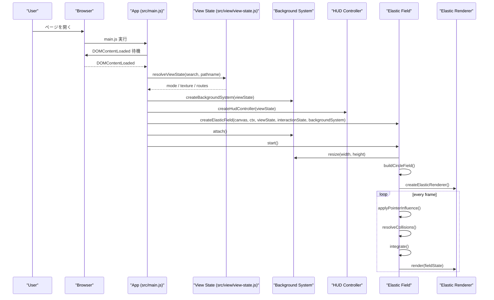
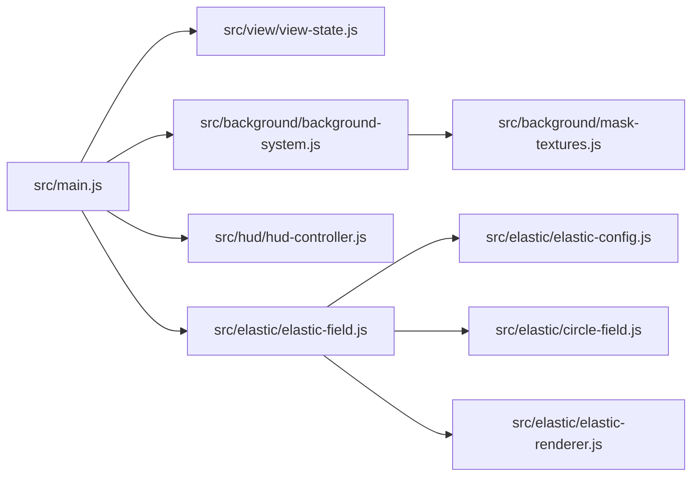
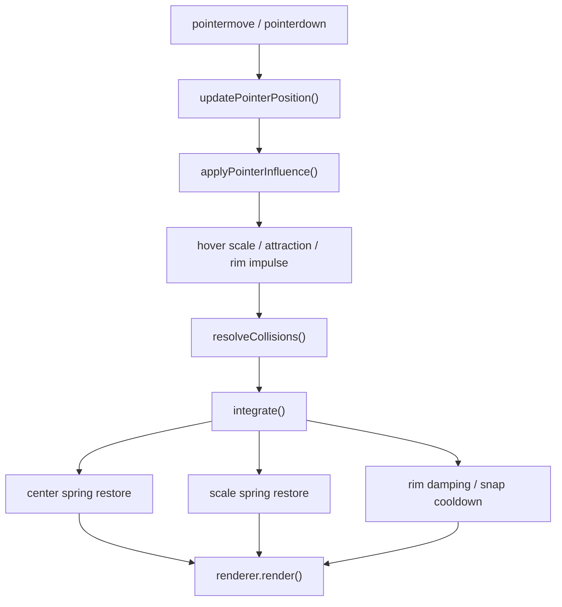
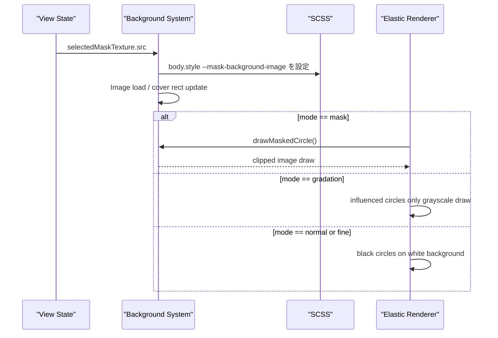

# Elastic 2D Balls UML

関連資料:

- `README.md`
- `CODE_READING.md`

## 1. 起動から初回描画まで

```mermaid
sequenceDiagram
  participant U as "User"
  participant B as "Browser"
  participant A as "App (src/main.js)"
  participant V as "View State (src/view/view-state.js)"
  participant BG as "Background System"
  participant H as "HUD Controller"
  participant F as "Elastic Field"
  participant R as "Elastic Renderer"

  U->>B: ページを開く
  B->>A: main.js 実行
  A->>B: DOMContentLoaded 待機
  B-->>A: DOMContentLoaded
  A->>V: resolveViewState(search, pathname)
  V-->>A: mode / texture / routes
  A->>BG: createBackgroundSystem(viewState)
  A->>H: createHudController(viewState)
  A->>F: createElasticField(canvas, ctx, viewState, interactionState, backgroundSystem)
  A->>BG: attach()
  A->>F: start()
  F->>BG: resize(width, height)
  F->>F: buildCircleField()
  F->>R: createElasticRenderer()
  loop every frame
    F->>F: applyPointerInfluence()
    F->>F: resolveCollisions()
    F->>F: integrate()
    F->>R: render(fieldState)
  end
```

## 2. 責務分割

```mermaid
flowchart LR
  A["src/main.js"] --> B["src/view/view-state.js"]
  A --> C["src/background/background-system.js"]
  A --> D["src/hud/hud-controller.js"]
  A --> E["src/elastic/elastic-field.js"]
  C --> F["src/background/mask-textures.js"]
  E --> G["src/elastic/elastic-config.js"]
  E --> H["src/elastic/circle-field.js"]
  E --> I["src/elastic/elastic-renderer.js"]
```

## 3. 円の弾性更新フロー

```mermaid
flowchart TD
  A["pointermove / pointerdown"] --> B["updatePointerPosition()"]
  B --> C["applyPointerInfluence()"]
  C --> D["hover scale / attraction / rim impulse"]
  D --> E["resolveCollisions()"]
  E --> F["integrate()"]
  F --> G["center spring restore"]
  F --> H["scale spring restore"]
  F --> I["rim damping / snap cooldown"]
  G --> J["renderer.render()"]
  H --> J
  I --> J
```

## 4. 背景画像と描画分岐

```mermaid
sequenceDiagram
  participant V as "View State"
  participant BG as "Background System"
  participant CSS as "SCSS"
  participant R as "Elastic Renderer"

  V->>BG: selectedMaskTexture.src
  BG->>CSS: body.style --mask-background-image を設定
  BG->>BG: Image load / cover rect update
  alt mode == mask
    R->>BG: drawMaskedCircle()
    BG-->>R: clipped image draw
  else mode == gradation
    R->>R: influenced circles only grayscale draw
  else mode == normal or fine
    R->>R: black circles on white background
  end
```
