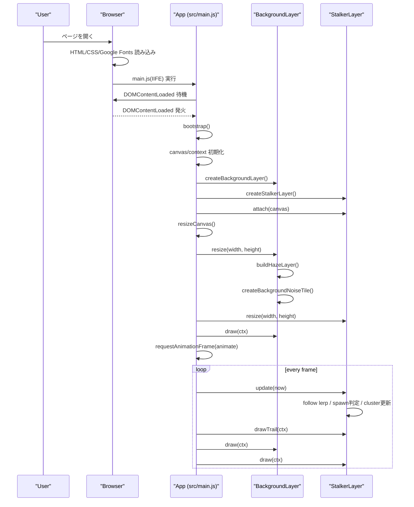
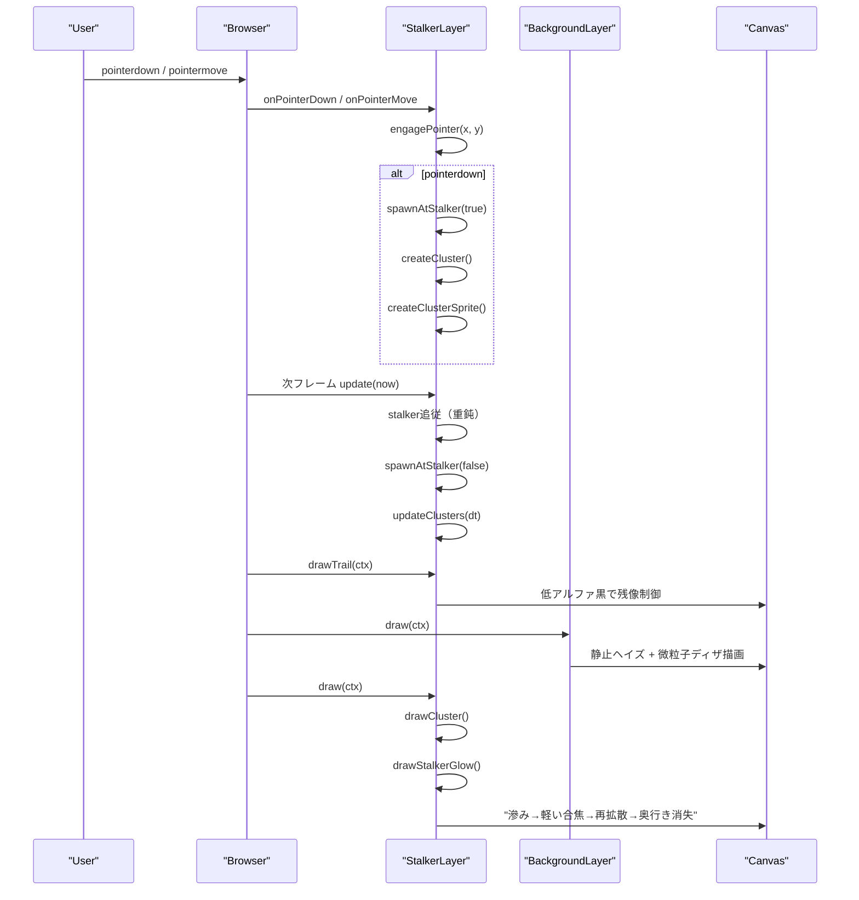
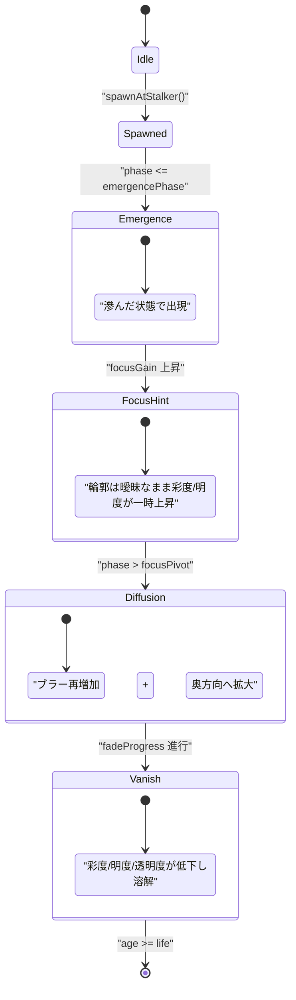

# Mouse Stalker UML

## 1. 起動から初回描画まで

```mermaid
sequenceDiagram
  participant U as "User"
  participant B as "Browser"
  participant A as "App (src/main.js)"
  participant BG as "BackgroundLayer"
  participant ST as "StalkerLayer"

  U->>B: ページを開く
  B->>B: HTML/CSS/Google Fonts 読み込み
  B->>A: main.js(IIFE) 実行
  A->>B: DOMContentLoaded 待機
  B-->>A: DOMContentLoaded 発火
  A->>A: bootstrap()
  A->>A: canvas/context 初期化
  A->>BG: createBackgroundLayer()
  A->>ST: createStalkerLayer()
  A->>ST: attach(canvas)
  A->>A: resizeCanvas()
  A->>BG: resize(width, height)
  BG->>BG: buildHazeLayer()
  BG->>BG: createBackgroundNoiseTile()
  A->>ST: resize(width, height)
  A->>BG: draw(ctx)
  A->>A: requestAnimationFrame(animate)
  loop every frame
    A->>ST: update(now)
    ST->>ST: follow lerp / spawn判定 / cluster更新
    A->>ST: drawTrail(ctx)
    A->>BG: draw(ctx)
    A->>ST: draw(ctx)
  end
```

## 2. ユーザー操作時の描画機序（背景とストーカーの独立動作）

```mermaid
sequenceDiagram
  participant U as "User"
  participant B as "Browser"
  participant ST as "StalkerLayer"
  participant BG as "BackgroundLayer"
  participant C as "Canvas"

  U->>B: pointerdown / pointermove
  B->>ST: onPointerDown / onPointerMove
  ST->>ST: engagePointer(x, y)
  alt pointerdown
    ST->>ST: spawnAtStalker(true)
    ST->>ST: createCluster()
    ST->>ST: createClusterSprite()
  end

  B->>ST: 次フレーム update(now)
  ST->>ST: stalker追従（重鈍）
  ST->>ST: spawnAtStalker(false)
  ST->>ST: updateClusters(dt)

  B->>ST: drawTrail(ctx)
  ST->>C: 低アルファ黒で残像制御

  B->>BG: draw(ctx)
  BG->>C: 静止ヘイズ + 微粒子ディザ描画

  B->>ST: draw(ctx)
  ST->>ST: drawCluster()
  ST->>ST: drawStalkerGlow()
  ST->>C: "滲み→軽い合焦→再拡散→奥行き消失"
```

## 3. 花弁クラスタの状態遷移

```mermaid
stateDiagram-v2
  [*] --> Idle
  Idle --> Spawned: "spawnAtStalker()"
  Spawned --> Emergence: "phase <= emergencePhase"
  Emergence --> FocusHint: "focusGain 上昇"
  FocusHint --> Diffusion: "phase > focusPivot"
  Diffusion --> Vanish: "fadeProgress 進行"
  Vanish --> [*]: "age >= life"

  state Emergence {
    [*] --> "滲んだ状態で出現"
  }
  state FocusHint {
    [*] --> "輪郭は曖昧なまま彩度/明度が一時上昇"
  }
  state Diffusion {
    [*] --> "ブラー再増加 + 奥方向へ拡大"
  }
  state Vanish {
    [*] --> "彩度/明度/透明度が低下し溶解"
  }
```
